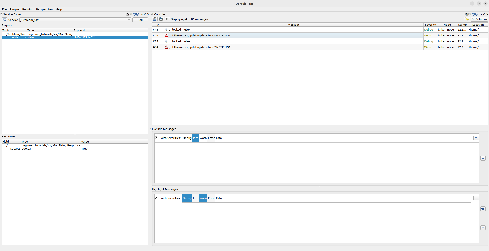

# beginner_tutorials

Beginner tutorials repo for ENPM808X<br>
This package was built and tested for ros2-humble on an ubuntu 22.04 distro.<br>

## Install process

1. Clone this repo in a ros2 workspace : ```git clone https://github.com/vedran97/beginner_tutorials.git```
2. Install dependencies by running ```rosdep install -i --from-path src --rosdistro humble -y``` in the root of your workspace.
3. Build the package with the following command:

## Build commands

1. ```colcon build --symlink-install --cmake-args -DCMAKE_EXPORT_COMPILE_COMMANDS=ON --parallel-workers $(nproc)```

## Running the code

1. Once the code is built in a ros2 ws, source the workspace.
2. to run the publisher: ```ros2 run beginner_tutorials talker```. Topic for publishing: ```Problem_Pub```
3. to run the subscriber: ```ros2 run beginner_tutorials listener```
4. using launch file,launch both nodes: ```ros2 launch beginner_tutorials launch_pub_sub.py``` => Param="time_period_int_ms" controls after how many ms the string is published.
Call to this service: ```/Problem_Srv``` with request type ```string``` can change the string which is published. Use rqt console to call this service or ```ros2 service call /Problem_Srv beginner_tutorials/srv/ModString "{publish_this: "something_new"}"```
5. if using vscode terminal , before running rqt type this:```unset GTK_PATH```
6. Multiple log levels:


## Instructions to run the cpptools

```bash
# run clang-format

  cd src/beginner_tutorials && clang-format -i --style=Google $(find . -name *.cpp -o -name *.hpp | grep -vE -e "^(./build/|./install/|./log/)") && cd -

# run cppcheck

  mkdir results -p && cppcheck --enable=all --std=c++17 -I include/ --suppress=missingInclude --inline-suppr $( find . -name *.cpp | grep -vE -e "^(./build/|./install/|./log/)" ) &> results/cppcheck

# run cpplint

  mkdir results -p && cpplint  --filter=-build/c++11,+build/c++17,-build/namespaces,-build/include_order $( find . -name *.cpp | grep -vE -e "^(./build/|./install/|./log/)" ) &> results/cpplint

```

## Instructions to run the tests

1. cd to your colcon_ws
2. source appropriate ros
3. Run this ```rm -rf build/beginner_tutorials```
4. Run this next to build ws,source ws,run the test```colcon build --symlink-install --cmake-args -DCMAKE_EXPORT_COMPILE_COMMANDS=ON --parallel-workers $(nproc) --packages-select beginner_tutorials && source install/setup.bash && colcon test --packages-select beginner_tutorials```
5. Run this to check results: ```cat log/latest_test/beginner_tutorials/stdout_stderr.log```